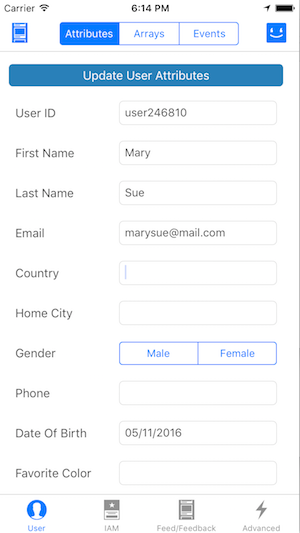
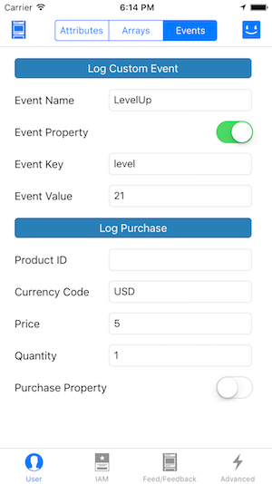
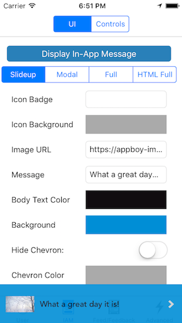

# Welcome to Braze's sample project!

Stopwatch is a sample application that shows Braze in action. Below are some screenshots that will reference how to:

* Set user attributes for the existing user on the device
* Log custom event data and in-app purchases to Braze
* Activate an in-app message
* Display an Braze Feedback form and News Feed
* Theme Braze programmatically
* Miscellaneous features

## Getting Started
Start by taking a look at `AppDelegate.m` to see how Braze starts up. Other logic in this class shows how to [integrate push notifications](https://documentation.braze.com/iOS/#step-3-update-application-code) and pass device tokens to Braze and handle [deep links](https://documentation.braze.com/iOS/#deep-linking).  You can copy the sample code right into your project, though be sure to change the API key.

## Setting User Attributes
Stopwatch's home page (the User tab) gives an example of how Braze can collect user information from your application.

Take a look at `UserAttributesViewController.m` file to see how you can report user attributes back to Braze. Braze also supports setting arrays as user attributes, which can be found under the Arrays segment of the User tab. By default, data is flushed up to Braze's servers every 10 seconds. Clicking the Braze smiley in the top right corner will immediately flush your data to Braze. Take a look at the [Advanced tab](#advanced) to see how you can customize data flush settings in your application.

## Custom Events and In-App Purchases
You can log custom events and purchases on the User tab, under the Events segment. Braze also supports logging event and purchase properties in the form of key-value pairs.

Take a look at `EventsViewController` to see how to handle logging events and purchases in your app.

## In-App Messages (IAMs)
You'll notice when you first open Stopwatch that a small, unobtrusive message appears on the bottom of the screen. This message is there to alert your users to new content. When you use a Production API Key, this in-app message only appears when you push out new content from the Braze dashboard, but for this sample app it will appear every time the app is foregrounded.

Braze provides four different in-app message types: slideup, modal, full-screen and custom HTML. These in-app messages are highly customizable, both [through the dashboard](https://documentation.braze.com/iOS/#dashboard-in-app-message-customization) and [via code](https://documentation.braze.com/iOS/#advanced-in-app-message-customization-options). You can experiment with customizing Braze's in-app messages on the IAM tab.

In addition to changing display settings, you can control the timing of the in-app message so that it does not appear, or appears only when you want it to. `InAppMessageTestViewController.m` has code samples for how to handle displaying and queuing of incoming in-app messages, including via creating custom view controllers.

## Feedback Form and News Feed
Next, take a look at the Storyboard for examples of how you might set up the UI in your app. You'll see an example of how to open the Braze News Feed via a push onto the navigation stack using an `ABKFeedViewControllerNavigationContext`, as well as how to do the same with a Feedback form via `ABKFeedbackViewControllerNavigationContext`.

The content of the News Feed is controlled through Braze's [online dashboard](https://dashboard.braze.com).

`FeedAndFeedbackUIViewController.m` also has examples of creating the News Feed and Feedback forms programmatically both in a modal view and in a combined, single-button context.

## Advanced
The Advanced tab holds examples of [fine network traffic control](https://documentation.braze.com/iOS/#fine-network-traffic-control), logging [social](https://documentation.braze.com/iOS/#social-data-tracking) and [location](https://documentation.braze.com/iOS/#location-tracking) data, and more.
- View `MiscViewController.m` to see how you can change your app's data request processing policy.
- `AppDelegate.m` shows how to authorize Braze to request location authorization on your behalf, and `MiscViewController.m` gives an example of logging location data.
- View `FacebookViewController` and `TwitterViewController` for examples of how to integrate social data tracking into your application.

## Next Steps
Finally, look around for other examples of how to use the methods employed throughout Stopwatch.

Don't hesitate to contact us if you have questions at [support@braze.com](mailto:support@braze.com)!
