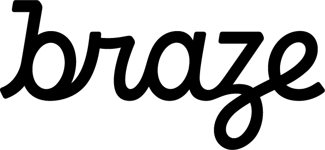

### ⚠ The new [Braze Swift SDK](https://github.com/braze-inc/braze-swift-sdk) is now available! ⚠

The Appboy iOS SDK (Objective-C SDK) is no longer in active development. All new iOS features Braze releases, like Live Activities and Feature Flags, will only be supported on the [Swift SDK](https://github.com/braze-inc/braze-swift-sdk). Any further updates the Appboy iOS SDK receives will only address security or critical bugs. After March 1, 2024 this repository will no longer be maintained.

See [our blog post](https://www.braze.com/resources/articles/introducing-the-new-braze-swift-sdk) for more information.

 

# iOS SDK

Successful marketing automation is essential to the future of your mobile app. Braze helps you engage your users beyond the download. Visit the following links for details and we'll have you up and running in no time!

- [Braze User Guide](https://www.braze.com/docs/user_guide/introduction/ "Braze User Guide")
- [Braze Developer Guide](https://www.braze.com/docs/developer_guide/platform_integration_guides/ios/initial_sdk_setup/ "Braze Developer Guide")
- [Full Class Documentation](http://appboy.github.io/appboy-ios-sdk/docs/annotated.html "Braze iOS SDK Class Documentation")

## Components

- `AppboyKit` - Contains the variant of our SDK.
- `AppboyUI` - Contains the open-source UI code of our SDK. Not all of the UI code of the SDK is open-source.
- `Samples` - Contains sample apps for different Braze features.
- `Example` - Contains the Stopwatch Sample App which contains integration examples for the iOS SDK.
	- The Stopwatch Sample App uses our [CocoaPods](http://guides.cocoapods.org/) integration (`Appboy-iOS-SDK`), so you must :
	  1. [Install CocoaPods](http://guides.cocoapods.org/using/getting-started.html)
	  2. Run `pod install` in the `Example` directory
	  3. Open the `Stopwatch.xcworkspace` to open the project.

## Version Support

- The iOS SDK supports iOS `11.0`+.
- This SDK is built using Xcode `14.2`.
  - SDK versions prior to `4.6.0` were built with Xcode `13.x` or older.

 as a prebuilt framework.  Building from source currently not supported, see [#85](https://github.com/Appboy/appboy-ios-sdk/issues/85). 

## Questions?

If you have questions, please contact [support@braze.com](mailto:support@braze.com).
